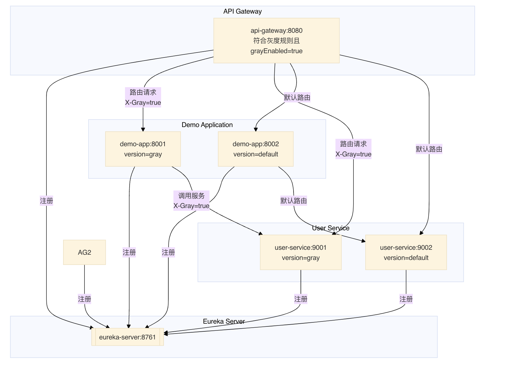
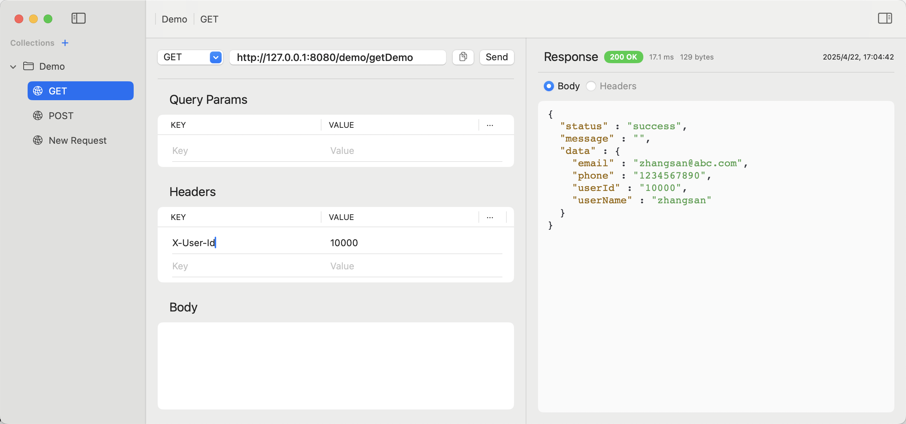

# GrayReleaseDemo

This project is demo for gray release.

There are 4 services and 1 common module

- api-gateway
- eureka-server
- demo-application
- user-service




Client Request Test



### Run services

```Bash
$cd <service directory>
$mvn clean install -Dmaven.test.skip=true #编译安装
$mvn package -Dmaven.test.skip=true  #打包成jar
$mvn spring-boot:run   #运行default配置的服务
$mvn spring-boot:run -Dspring.profiles.active=gray  #运行gray release配置的服务


```


### Explaination

- API-Gateway

When gateway gets request from A client, it will check properties and request header "X-User-Id".

If it fullfilled the rules, then request will be added by a gray flag request header: "X-Gray"="true".

In this cases, the "X-User-Id"=10000 and

```properties
#set gray switch

gray.enabled=true

gray.userIds=10000,10001
```

```Java
//GrayFilter.java
@Component
public class GrayFilter implements GlobalFilter {

	Logger logger = LoggerFactory.getLogger(GrayFilter.class);

	@Autowired
	private Environment env;


	@Override
	public Mono<Void> filter(ServerWebExchange exchange, GatewayFilterChain chain) {

		// Implement your gray filter logic here
		//read gray.enabled and gray.userIds from application.properties
		String grayEnabledString = env.getProperty("gray.enabled");
		String grayUserIds = env.getProperty("gray.userIds");
		logger.info("Gray filter executing, enabled: {}, Gray userIds:{}", grayEnabledString, grayUserIds);

		boolean needGrayHeaders = false;
		if ("true".equalsIgnoreCase(grayEnabledString)) {
			logger.info("Gray filter is enabled");
		   	if (grayUserIds != null && grayUserIds.length() > 0) {
			    String[] userIds = grayUserIds.split(",");
			    // 获取请求头中的 userId
			    ServerHttpRequest request =  exchange.getRequest();
			    logger.info("Config grayUserIds: {}", userIds);
			    logger.info("Request Headers: {}", request.getHeaders());
			    if (request.getHeaders().containsKey("X-User-Id")) {
			    	// Check if the userId in the request header matches any of the userIds in the config
			    	logger.info("Request Headers contains userId");
			    	String currentUserId = request.getHeaders().get("X-User-Id").get(0);
			    	if(ArrayUtils.contains(userIds, currentUserId)) {
			    		needGrayHeaders = true;
			    		logger.info("UserId {} is in gray list", currentUserId);
			    	} else {
			    		logger.info("UserId {} is not in gray list", currentUserId);
			    	}
			  
			    }
			   
		    }
		}
		logger.info("needGrayHeaders: {}", needGrayHeaders);
		if (needGrayHeaders) {
			// Add gray headers to the request
			Builder builder = exchange.getRequest().mutate();
			builder.header("X-Gray", "true");
			ServerHttpRequest request = builder.build();
			exchange = exchange.mutate().request(request).build();

		}
		logger.info("After processing Request Headers: {}", exchange.getRequest().getHeaders());
		return chain.filter(exchange);
	}

}

```

And Use FeignClient and Spring Cloud loadbalancer. Spring Cloud loadbalancer is client load balancer. Use object service meta data to select service.


```java
@Configuration
@LoadBalancerClients({
	@LoadBalancerClient(name = "user-service", configuration = UserServiceLoadBalancerConfig.class),
	@LoadBalancerClient(name = "demo-application", configuration = UserServiceLoadBalancerConfig.class)
})
public class UserServiceLoadBalancerConfig {

	@Bean
    public ReactorLoadBalancer<ServiceInstance> reactorServiceInstanceLoadBalancer(
            Environment env, LoadBalancerClientFactory factory) {
        String serviceId = env.getProperty(LoadBalancerClientFactory.PROPERTY_NAME);
        return new GrayRandomLoadBalancer(
				factory.getLazyProvider(serviceId, ServiceInstanceListSupplier.class),
				serviceId
			);
    
    }
}

```

```java
package loadbalancer.gray; // must not in bean scan directory
import java.util.List;
import java.util.concurrent.ThreadLocalRandom;

import org.apache.commons.logging.Log;
import org.apache.commons.logging.LogFactory;
import reactor.core.publisher.Mono;
import org.springframework.cloud.loadbalancer.core.NoopServiceInstanceListSupplier;
import org.springframework.beans.factory.ObjectProvider;
import org.springframework.cloud.client.ServiceInstance;
import org.springframework.cloud.client.loadbalancer.DefaultResponse;
import org.springframework.cloud.client.loadbalancer.EmptyResponse;
import org.springframework.cloud.client.loadbalancer.Request;
import org.springframework.cloud.client.loadbalancer.RequestDataContext;
import org.springframework.cloud.client.loadbalancer.Response;
import org.springframework.cloud.loadbalancer.core.ReactorServiceInstanceLoadBalancer;
import org.springframework.cloud.loadbalancer.core.SelectedInstanceCallback;
import org.springframework.cloud.loadbalancer.core.ServiceInstanceListSupplier;
import org.springframework.http.HttpHeaders;
import org.springframework.util.function.SingletonSupplier;

/**
 * A random-based implementation of {@link ReactorServiceInstanceLoadBalancer}.
 * 
 */
public class GrayRandomLoadBalancer implements ReactorServiceInstanceLoadBalancer {

	private static final Log log = LogFactory.getLog(GrayRandomLoadBalancer.class);

	private final String serviceId;

	private final SingletonSupplier<ServiceInstanceListSupplier> serviceInstanceListSingletonSupplier;

	/**
	 * @param serviceInstanceListSupplierProvider a provider of
	 * {@link ServiceInstanceListSupplier} that will be used to get available instances
	 * @param serviceId id of the service for which to choose an instance
	 */
	public GrayRandomLoadBalancer(ObjectProvider<ServiceInstanceListSupplier> serviceInstanceListSupplierProvider,
			String serviceId) {
		this.serviceId = serviceId;
		this.serviceInstanceListSingletonSupplier = SingletonSupplier.of(() -> serviceInstanceListSupplierProvider.getIfAvailable(NoopServiceInstanceListSupplier::new));
	}

	@SuppressWarnings("rawtypes")
	@Override
	public Mono<Response<ServiceInstance>> choose(Request request) {
		ServiceInstanceListSupplier supplier = serviceInstanceListSingletonSupplier.obtain();
		return supplier.get(request)
			.next()
			.map(serviceInstances -> processInstanceResponse(supplier, serviceInstances, request));
	}

	private Response<ServiceInstance> processInstanceResponse(ServiceInstanceListSupplier supplier,
			List<ServiceInstance> serviceInstances, Request request) {
		Response<ServiceInstance> serviceInstanceResponse = getInstanceResponse(serviceInstances, request);
		if (supplier instanceof SelectedInstanceCallback && serviceInstanceResponse.hasServer()) {
			((SelectedInstanceCallback) supplier).selectedServiceInstance(serviceInstanceResponse.getServer());
		}
		return serviceInstanceResponse;
	}

	private Response<ServiceInstance> getInstanceResponse(List<ServiceInstance> instances, Request request) {
		if (instances.isEmpty()) {
			if (log.isWarnEnabled()) {
				log.warn("No servers available for service: " + serviceId);
			}
			return new EmptyResponse();
		}
		List<ServiceInstance> filteredInstances = instances;
		HttpHeaders headers = ((RequestDataContext) request.getContext()).getClientRequest().getHeaders();
		log.info("########Get request Headers: " + headers);
		boolean isGrayRequest = "true".equals(headers.getFirst("X-Gray"));
		if (isGrayRequest) {
			// 处理灰度请求
			log.info("Gray request detected, filtering instances");
			List<ServiceInstance> grayInstances = instances.stream()
					.filter(instance -> "gray".equals(instance.getMetadata().get("version")))
					.toList();
			if (grayInstances.isEmpty()) {
				log.warn("No gray instances available for service: " + serviceId);
				return new EmptyResponse();
			} else {
				filteredInstances = grayInstances;
			} 
		}
		int index = ThreadLocalRandom.current().nextInt(filteredInstances.size());

		ServiceInstance instance = filteredInstances.get(index);

		return new DefaultResponse(instance);
	}

}


```
